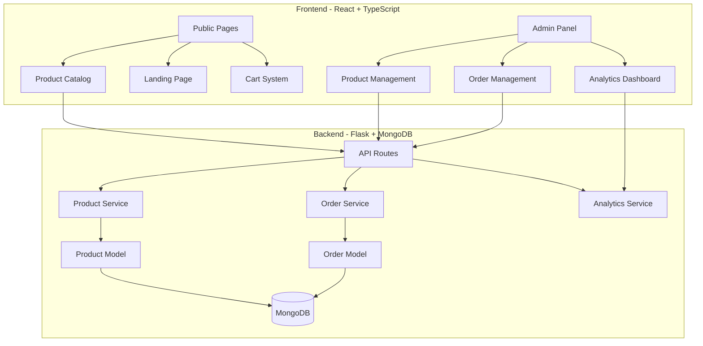

# Design Document

## Overview

This design document outlines the comprehensive improvements to the Swati Jewellers e-commerce platform. The solution implements a product draft/publish workflow, enhances the admin panel with better product and order management capabilities, and modernizes the UI/UX across all public-facing pages. The design follows a modular architecture that separates concerns between backend API services, frontend components, and state management.

### Key Design Principles

1. **Separation of Concerns**: Backend handles business logic and data persistence; frontend focuses on presentation and user interaction
2. **Progressive Enhancement**: Core functionality works first, then enhanced with better UX
3. **Mobile-First Responsive Design**: All interfaces designed for mobile devices first, then scaled up
4. **Performance Optimization**: Lazy loading, caching, and code splitting for optimal load times
5. **Maintainability**: Clean code structure with TypeScript types and consistent patterns

## Architecture

### System Architecture Diagram



### Technology Stack

**Frontend:**
- React 18 with TypeScript
- React Router for navigation
- Tailwind CSS for styling
- Axios for API communication
- React Toastify for notifications
- Lucide React for icons

**Backend:**
- Flask (Python web framework)
- MongoEngine (MongoDB ODM)
- Flask-JWT-Extended for authentication
- Flask-CORS for cross-origin requests

## Components and Interfaces

### 1. Product Draft/Publish System

#### Backend Components

**Product Model Enhancement**


```python
# backend/app/models/product.py
class Product(Document):
    # Existing fields...
    status = StringField(
        required=True,
        choices=['draft', 'published'],
        default='draft'
    )
    published_at = DateTimeField()
    
    def publish(self):
        """Publish a draft product"""
        self.status = 'published'
        self.published_at = datetime.utcnow()
        self.save()
    
    def unpublish(self):
        """Unpublish a product back to draft"""
        self.status = 'draft'
        self.published_at = None
        self.save()
```

**Product Service Enhancement**

```python
# backend/app/services/product_service.py
class ProductService:
    @staticmethod
    def get_public_products(filters):
        """Get only published products for public view"""
        query = Q(is_active=True, status='published')
        # Apply additional filters...
        
    @staticmethod
    def get_admin_products(filters):
        """Get all products (draft + published) for admin"""
        query = Q(is_active=True)
        # Apply additional filters...
        
    @staticmethod
    def publish_product(product_id):
        """Publish a draft product"""
        product = Product.objects(id=product_id).first()
        if product:
            product.publish()
            return product
        return None
```

**API Routes**

```python
# backend/app/routes/products.py
@bp.route('/', methods=['GET'])
def get_products():
    """Public endpoint - returns only published products"""
    # Filter by status='published'
    
@bp.route('/admin', methods=['GET'])
@jwt_required()
@admin_required
def get_admin_products():
    """Admin endpoint - returns all products"""
    # No status filter
    
@bp.route('/<product_id>/publish', methods=['POST'])
@jwt_required()
@admin_required
def publish_product(product_id):
    """Publish a draft product"""
    product = ProductService.publish_product(product_id)
    return jsonify({'success': True, 'data': product.to_dict()})
```

#### Frontend Components

**TypeScript Types**

```typescript
// src/types/index.ts
export interface Product {
  // Existing fields...
  status: 'draft' | 'published';
  published_at?: string;
}

export interface ProductFilters {
  // Existing fields...
  status?: 'draft' | 'published' | 'all';
}
```

**Product Service Enhancement**

```typescript
// src/services/productService.ts
export const productService = {
  // Public endpoint - only published products
  getProducts: async (filters?: ProductFilters) => {
    return api.get('/products', { params: filters });
  },
  
  // Admin endpoint - all products
  getAdminProducts: async (filters?: ProductFilters) => {
    return api.get('/products/admin', { params: filters });
  },
  
  publishProduct: async (id: string) => {
    return api.post(`/products/${id}/publish`);
  },
  
  unpublishProduct: async (id: string) => {
    return api.post(`/products/${id}/unpublish`);
  },
};
```

### 2. Order Management System

#### Backend Components

**Order Model**

```python
# backend/app/models/order.py
class Order(Document):
    order_number = StringField(required=True, unique=True)
    customer_id = ReferenceField('Customer', required=True)
    customer_name = StringField(required=True)
    customer_phone = StringField(required=True)
    customer_email = StringField()
    
    # Order items
    items = ListField(EmbeddedDocumentField('OrderItem'))
    
    # Pricing
    subtotal = FloatField(required=True)
    tax_amount = FloatField(default=0)
    total_amount = FloatField(required=True)
    
    # Status tracking
    status = StringField(
        required=True,
        choices=['pending', 'processing', 'completed', 'cancelled'],
        default='pending'
    )
    payment_status = StringField(
        choices=['unpaid', 'partial', 'paid'],
        default='unpaid'
    )
    
    # Timestamps
    created_at = DateTimeField(default=datetime.utcnow)
    updated_at = DateTimeField(default=datetime.utcnow)
    completed_at = DateTimeField()
    
    # Notes
    notes = StringField()
    admin_notes = StringField()

class OrderItem(EmbeddedDocument):
    product_id = StringField(required=True)
    product_name = StringField(required=True)
    quantity = IntField(required=True, min_value=1)
    unit_price = FloatField(required=True)
    total_price = FloatField(required=True)
```

**Order Service**

```python
# backend/app/services/order_service.py
class OrderService:
    @staticmethod
    def create_order(data):
        """Create a new order"""
        order_number = OrderService.generate_order_number()
        order = Order(
            order_number=order_number,
            customer_id=data['customer_id'],
            # ... other fields
        )
        order.save()
        return order
    
    @staticmethod
    def update_order_status(order_id, status):
        """Update order status"""
        order = Order.objects(id=order_id).first()
        if order:
            order.status = status
            if status == 'completed':
                order.completed_at = datetime.utcnow()
            order.save()
            return order
        return None
    
    @staticmethod
    def get_orders_with_filters(page, per_page, status, date_from, date_to):
        """Get orders with pagination and filters"""
        query = Q()
        if status:
            query &= Q(status=status)
        if date_from:
            query &= Q(created_at__gte=date_from)
        if date_to:
            query &= Q(created_at__lte=date_to)
        
        total = Order.objects(query).count()
        orders = Order.objects(query).skip((page-1)*per_page).limit(per_page)
        return list(orders), total
```

#### Frontend Components

**Order Management Page**

```typescript
// src/pages/admin/OrderManagement.tsx
const OrderManagement = () => {
  const [orders, setOrders] = useState<Order[]>([]);
  const [filters, setFilters] = useState({
    status: 'all',
    dateFrom: '',
    dateTo: '',
  });
  
  const handleStatusChange = async (orderId: string, newStatus: string) => {
    await orderService.updateOrderStatus(orderId, newStatus);
    loadOrders();
  };
  
  return (
    <div>
      {/* Filters */}
      {/* Orders Table */}
      {/* Order Detail Modal */}
    </div>
  );
};
```

### 3. Enhanced Admin Product Management

**Product Management Component**

```typescript
// src/components/admin/ProductManagement.tsx
const ProductManagement = () => {
  const [products, setProducts] = useState<Product[]>([]);
  const [statusFilter, setStatusFilter] = useState<'all' | 'draft' | 'published'>('all');
  const [selectedProducts, setSelectedProducts] = useState<string[]>([]);
  
  const handleBulkPublish = async () => {
    await Promise.all(
      selectedProducts.map(id => productService.publishProduct(id))
    );
    loadProducts();
  };
  
  const handleBulkUnpublish = async () => {
    await Promise.all(
      selectedProducts.map(id => productService.unpublishProduct(id))
    );
    loadProducts();
  };
  
  return (
    <div>
      {/* Status Filter Tabs */}
      {/* Bulk Actions Bar */}
      {/* Products Table with Checkboxes */}
    </div>
  );
};
```

### 4. UI/UX Modernization

#### Landing Page Redesign

**Component Structure**

```typescript
// src/pages/Homepage.tsx
const Homepage = () => {
  return (
    <>
      <HeroSection />
      <FeaturedProducts />
      <CategoryShowcase />
      <WhyChooseUs />
      <Testimonials />
      <CTASection />
    </>
  );
};
```

**Hero Section Design**
- Full-screen hero with high-quality jewelry imagery
- Animated gradient background
- Clear value proposition
- Prominent CTA buttons
- Gold price ticker integration

**Featured Products Section**
- Grid layout with product cards
- Hover effects with image zoom
- Quick view functionality
- Add to cart from listing

#### Header Enhancement

**Sticky Navigation**
- Fixed position on scroll
- Transparent to solid background transition
- Search bar with autocomplete
- Cart preview dropdown
- User account menu

```typescript
// src/components/Navbar.tsx
const Navbar = () => {
  const [isScrolled, setIsScrolled] = useState(false);
  const [showSearch, setShowSearch] = useState(false);
  const [showCart, setShowCart] = useState(false);
  
  useEffect(() => {
    const handleScroll = () => {
      setIsScrolled(window.scrollY > 50);
    };
    window.addEventListener('scroll', handleScroll);
    return () => window.removeEventListener('scroll', handleScroll);
  }, []);
  
  return (
    <nav className={`fixed top-0 w-full z-50 transition-all ${
      isScrolled ? 'bg-black shadow-lg' : 'bg-transparent'
    }`}>
      {/* Navigation content */}
    </nav>
  );
};
```

#### Footer Redesign

**Multi-Column Layout**
- Company information
- Quick links
- Product categories
- Contact details
- Social media links
- Newsletter subscription
- Business hours

#### Cart System Enhancement

**Cart Context**

```typescript
// src/context/CartContext.tsx
interface CartItem {
  product: Product;
  quantity: number;
}

interface CartContextType {
  items: CartItem[];
  addItem: (product: Product, quantity: number) => void;
  removeItem: (productId: string) => void;
  updateQuantity: (productId: string, quantity: number) => void;
  clearCart: () => void;
  total: number;
}

export const CartProvider = ({ children }) => {
  const [items, setItems] = useState<CartItem[]>([]);
  
  // Load from localStorage on mount
  useEffect(() => {
    const saved = localStorage.getItem('cart');
    if (saved) setItems(JSON.parse(saved));
  }, []);
  
  // Save to localStorage on change
  useEffect(() => {
    localStorage.setItem('cart', JSON.stringify(items));
  }, [items]);
  
  // Cart operations...
};
```

**Cart Page**

```typescript
// src/pages/Cart.tsx
const Cart = () => {
  const { items, updateQuantity, removeItem, total } = useCart();
  
  return (
    <div className="max-w-7xl mx-auto px-4 py-12">
      <h1>Shopping Cart</h1>
      
      {items.length === 0 ? (
        <EmptyCart />
      ) : (
        <>
          <CartItems items={items} />
          <CartSummary total={total} />
          <CheckoutButton />
        </>
      )}
    </div>
  );
};
```

## Data Models

### Enhanced Product Model

```python
class Product(Document):
    # Basic information
    name = StringField(required=True, max_length=200)
    category = StringField(required=True, choices=[...])
    
    # Pricing and weight
    base_price = FloatField(required=True, min_value=0)
    weight = FloatField(required=True, min_value=0)
    gold_purity = StringField(choices=['916', '750', '585'], default='916')
    
    # Details
    description = StringField()
    image_url = StringField()
    stock_quantity = IntField(default=0, min_value=0)
    
    # Status fields (NEW)
    status = StringField(
        required=True,
        choices=['draft', 'published'],
        default='draft'
    )
    published_at = DateTimeField()
    
    # Existing status
    is_active = BooleanField(default=True)
    created_at = DateTimeField(default=datetime.utcnow)
    updated_at = DateTimeField(default=datetime.utcnow)
```

### Order Model

```python
class Order(Document):
    order_number = StringField(required=True, unique=True)
    customer_id = ReferenceField('Customer', required=True)
    customer_name = StringField(required=True)
    customer_phone = StringField(required=True)
    customer_email = StringField()
    
    items = ListField(EmbeddedDocumentField('OrderItem'))
    
    subtotal = FloatField(required=True)
    tax_amount = FloatField(default=0)
    total_amount = FloatField(required=True)
    
    status = StringField(
        required=True,
        choices=['pending', 'processing', 'completed', 'cancelled'],
        default='pending'
    )
    payment_status = StringField(
        choices=['unpaid', 'partial', 'paid'],
        default='unpaid'
    )
    
    created_at = DateTimeField(default=datetime.utcnow)
    updated_at = DateTimeField(default=datetime.utcnow)
    completed_at = DateTimeField()
    
    notes = StringField()
    admin_notes = StringField()
```

## Error Handling

### Backend Error Handling

**Consistent Error Response Format**

```python
{
    "success": False,
    "error": {
        "code": 400,
        "message": "Validation error",
        "details": {...}
    }
}
```

**Error Handler Middleware**
- Already implemented in `backend/app/__init__.py`
- Handles MongoEngine validation errors
- Handles JWT authentication errors
- Handles generic exceptions with appropriate status codes

### Frontend Error Handling

**Error Boundary Component**

```typescript
// src/components/ErrorBoundary.tsx
class ErrorBoundary extends React.Component {
  state = { hasError: false, error: null };
  
  static getDerivedStateFromError(error) {
    return { hasError: true, error };
  }
  
  componentDidCatch(error, errorInfo) {
    console.error('Error caught by boundary:', error, errorInfo);
  }
  
  render() {
    if (this.state.hasError) {
      return <ErrorFallback error={this.state.error} />;
    }
    return this.props.children;
  }
}
```

**API Error Handling Utility**

```typescript
// src/utils/errorHandler.ts
export const getErrorMessage = (error: unknown): string => {
  if (axios.isAxiosError(error)) {
    return error.response?.data?.error?.message || 'An error occurred';
  }
  if (error instanceof Error) {
    return error.message;
  }
  return 'An unexpected error occurred';
};
```

## Testing Strategy

### Backend Testing

**Unit Tests**
- Test product service methods (create, update, publish, unpublish)
- Test order service methods (create, update status, filters)
- Test model validation and constraints

**Integration Tests**
- Test API endpoints with authentication
- Test database operations
- Test error handling

**Test Files Structure**
```
backend/
  tests/
    test_product_service.py
    test_order_service.py
    test_product_routes.py
    test_order_routes.py
```

### Frontend Testing

**Component Tests**
- Test product management component
- Test order management component
- Test cart functionality
- Test responsive behavior

**Integration Tests**
- Test complete user flows (browse → add to cart → checkout)
- Test admin flows (create product → publish → manage orders)

**E2E Tests** (Optional)
- Test critical user journeys
- Test across different browsers and devices

## Performance Optimization

### Frontend Optimizations

1. **Code Splitting**
   - Lazy load admin pages
   - Lazy load heavy components (charts, modals)
   - Route-based code splitting

2. **Image Optimization**
   - Lazy loading for product images
   - Responsive images with srcset
   - WebP format with fallbacks
   - Image CDN integration

3. **Caching Strategy**
   - Cache product listings (5 minutes TTL)
   - Cache product details
   - Clear cache on mutations

4. **Bundle Optimization**
   - Tree shaking unused code
   - Minification and compression
   - CSS purging with Tailwind

### Backend Optimizations

1. **Database Indexing**
   - Index on product status and category
   - Index on order status and dates
   - Compound indexes for common queries

2. **Query Optimization**
   - Use projection to limit returned fields
   - Implement pagination for all list endpoints
   - Use aggregation pipeline for analytics

3. **Caching**
   - Cache frequently accessed data
   - Implement Redis for session storage (future)

## Security Considerations

### Authentication & Authorization

1. **JWT Token Management**
   - Secure token storage (httpOnly cookies or secure localStorage)
   - Token refresh mechanism
   - Token expiration handling

2. **Role-Based Access Control**
   - Admin-only routes protected with decorators
   - Frontend route guards for admin pages
   - API endpoint authorization checks

### Data Validation

1. **Backend Validation**
   - MongoEngine field validation
   - Custom validators for business rules
   - Input sanitization

2. **Frontend Validation**
   - Form validation before submission
   - TypeScript type checking
   - User input sanitization

### API Security

1. **CORS Configuration**
   - Whitelist allowed origins
   - Restrict methods and headers

2. **Rate Limiting** (Future Enhancement)
   - Implement rate limiting for API endpoints
   - Prevent brute force attacks

## Deployment Considerations

### Environment Configuration

**Backend Environment Variables**
```
FLASK_ENV=production
SECRET_KEY=<secure-random-key>
JWT_SECRET_KEY=<secure-random-key>
MONGODB_URI=<production-mongodb-uri>
CORS_ORIGINS=https://swatijewellers.com
```

**Frontend Environment Variables**
```
VITE_API_URL=https://api.swatijewellers.com
VITE_ENV=production
```

### Build Process

**Frontend Build**
```bash
npm run build
# Outputs to dist/ directory
# Serve with nginx or CDN
```

**Backend Deployment**
```bash
# Using Docker
docker-compose up -d

# Or using Gunicorn
gunicorn -w 4 -b 0.0.0.0:5000 run:app
```

### Database Migration

**Adding Status Field to Existing Products**
```python
# backend/scripts/migrate_product_status.py
from app.models.product import Product

def migrate_products():
    """Add status field to existing products"""
    products = Product.objects(status__exists=False)
    for product in products:
        product.status = 'published'  # Existing products are published
        product.save()
    print(f"Migrated {products.count()} products")
```

## Responsive Design Breakpoints

### Tailwind CSS Breakpoints
- **Mobile**: < 640px (sm)
- **Tablet**: 640px - 1023px (sm to lg)
- **Desktop**: ≥ 1024px (lg)
- **Large Desktop**: ≥ 1280px (xl)

### Component Responsive Behavior

**Product Grid**
- Mobile: 1 column
- Tablet: 2 columns
- Desktop: 3-4 columns

**Admin Tables**
- Mobile: Card layout with stacked information
- Tablet: Scrollable table
- Desktop: Full table with all columns

**Navigation**
- Mobile: Hamburger menu
- Desktop: Full horizontal menu

## Accessibility Considerations

1. **Semantic HTML**
   - Use proper heading hierarchy
   - Use semantic elements (nav, main, footer, article)

2. **ARIA Labels**
   - Add aria-labels to icon buttons
   - Use aria-live for dynamic content updates

3. **Keyboard Navigation**
   - Ensure all interactive elements are keyboard accessible
   - Implement focus management for modals

4. **Color Contrast**
   - Ensure WCAG AA compliance for text contrast
   - Don't rely solely on color for information

5. **Screen Reader Support**
   - Provide alt text for images
   - Use descriptive link text
   - Announce dynamic content changes

## Future Enhancements

1. **Advanced Search**
   - Elasticsearch integration
   - Faceted search
   - Search suggestions

2. **Wishlist Feature**
   - Save products for later
   - Share wishlist

3. **Product Reviews**
   - Customer reviews and ratings
   - Photo uploads

4. **Advanced Analytics**
   - Real-time dashboard
   - Custom date ranges
   - Export reports

5. **Notification System**
   - Email notifications for orders
   - SMS notifications
   - Push notifications

6. **Multi-language Support**
   - i18n implementation
   - Hindi and English support

7. **Payment Gateway Integration**
   - Razorpay/Stripe integration
   - Multiple payment methods
   - Payment tracking
